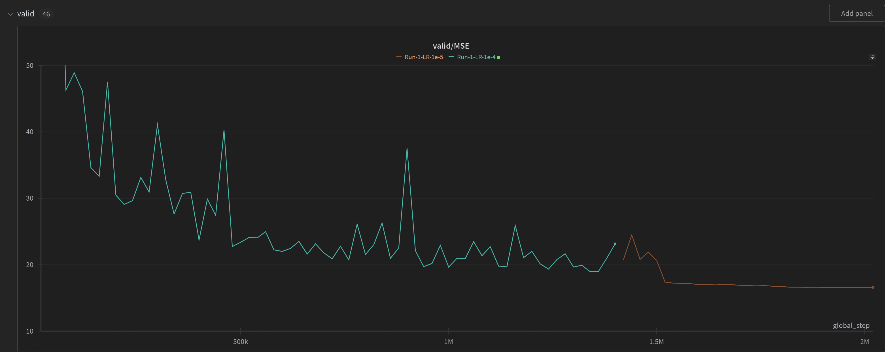
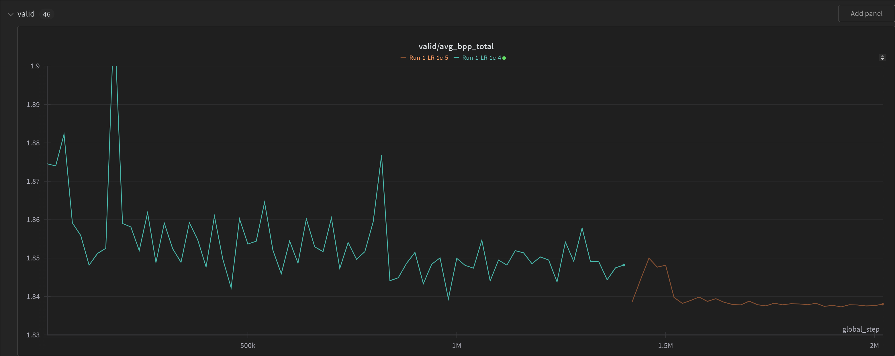
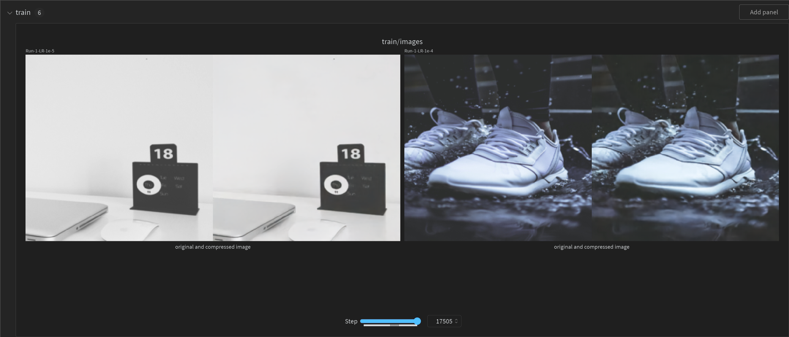
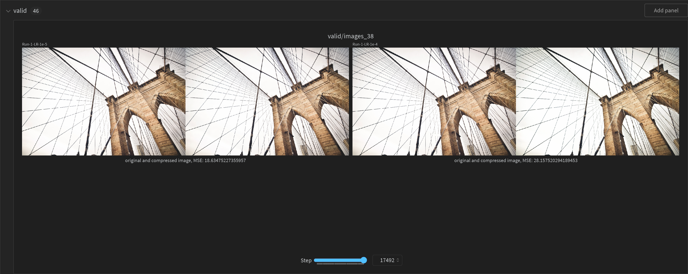

# AI Image Compression

## Introduction
As a Product Manager at Deep Render, I initiated this AI Image Compression project to enhance my understanding of the technical and engineering principles behind lossy image compression using neural networks. **Note:** This project is independent and was developed during my personal time, not affiliated with Deep Render.

The project is based on pioneering techniques detailed in "Joint Autoregressive and Hierarchical Priors for Learned Image Compression" and "Variational Image Compression with a Scale Hyperprior" by Ballé in 2018. These papers are recognized as foundational work in leveraging deep learning for advanced image compression methodologies. The core challenge in lossy image compression lies in balancing image quality (measured by distortion) against file size (measured by the rate).

## Results & Findings
The model was rigorously trained over 2 million iterations, utilizing an NVIDIA RTX 4090 GPU. The training process spanned approximately 48 hours, with performance evaluations continuously monitored and logged using Weights & Biases (Wandb). The training and validation phases were conducted on the CLIC2021 dataset, which is a standard benchmark in image compression research.

Key performance metrics from the CLIC2021 validation dataset are as follows:
- **Mean Squared Error (MSE):** 16.52, indicating the average squared difference between the original and compressed images. A lower MSE is better,
- **Bits Per Pixel (bpp):** 1.83, reflecting the average number of bits used for encoding each pixel in the image. A lower bpp is better,
- **Implied Compression Ratio:** 13.12 : 1.00, suggesting that the compression algorithm reduces the file size by over 13 times on average, without significant loss of quality.

These metrics indicate superior performance compared to standard JPEG and WebP compression techniques, showcasing the potential of advanced neural networks in image compression.

Below are the training curves that detail the progression of **MSE** (the distortion loss) and **bpp** (the rate loss) throughout the training process:




The below images illustrate the practical effects of the compression algorithm compared to standard methods, providing a visual confirmation of the numerical results:




## How to Run the Code
To test the AI image compression model on your own data, follow these steps:

1. **Enable Model Loading:**
   Change the `load_model` flag from `False` to `True` in the script to use the pre-trained model.
   
2. **Specify Model Path:**
   Update the script to point to the trained model saved after 2M iterations.

3. **Input Image Specifications:**
   Ensure that the input image path is specified correctly in the script.

4. **Output:**
   The decompressed image (`xhat`) will be saved automatically. The compression efficiency can be calculated using the `bpp_total` which represents the total bits per pixel, calculated as `bpp_total * height * width` of the input image.

## Requirements
To run this project, ensure you have the following installed:
- `PyTorch`: For model creation and training.
- `Weights & Biases (wandb)`: For tracking experiments and results.
- `CUDA`: Optional, for GPU acceleration if available.
- `tqdm`: For displaying progress bars during training and validation.

## Installation
Before running the code, install the required Python packages using:
```bash
pip install torch wandb tqdm
```
## Sources
- Ballé, J. (2018). **"Joint Autoregressive and Hierarchical Priors for Learned Image Compression"**. Retrieved from [link to the paper](https://arxiv.org/pdf/1809.02736)
- Ballé, J. (2018). **"Variational Image Compression with a Scale Hyperprior"**. Retrieved from [link to the paper](https://arxiv.org/pdf/1802.01436v2)

Additional resources and tools utilized in this project include:

- **Weights & Biases (Wandb)** - Tool for tracking experiments, used for monitoring model training and validation. More information available at [wandb.com](https://wandb.com).
- **PyTorch** - The deep learning framework used for model implementation. Documentation and more details can be found at [pytorch.org](https://pytorch.org).
- **CLIC2021 Dataset** - The dataset used for training and validation, details available at [CLIC website](https://www.compression.cc/2021/).